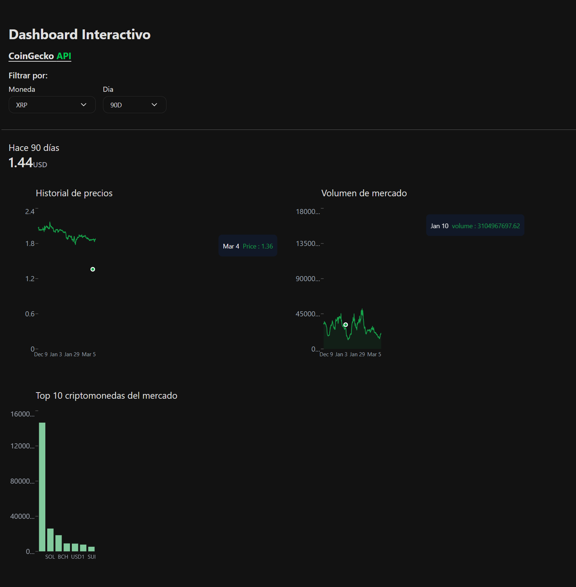
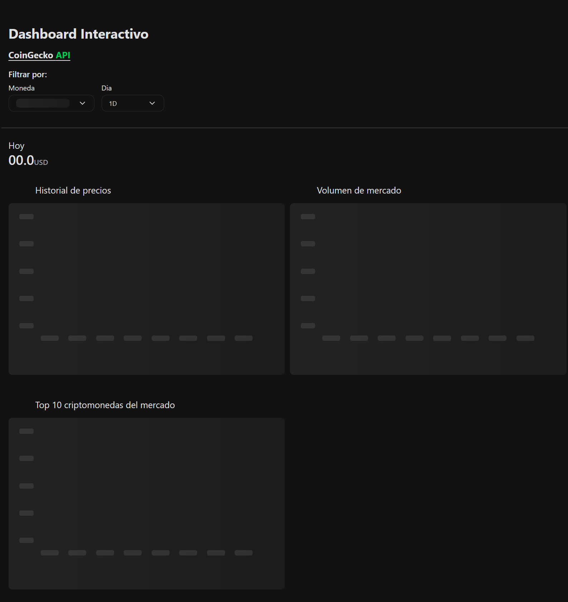
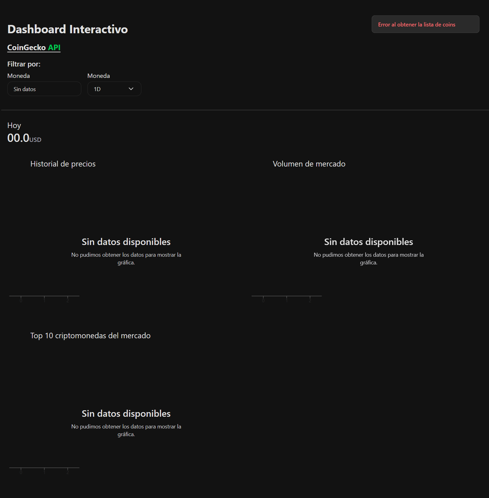

## Dashboard de criptomonedas – Dinametra (Frontend)

Aplicación **React + TypeScript + Vite** que muestra un dashboard interactivo de criptomonedas usando la **API pública de CoinGecko**.  
Incluye gráficos de historial de precios, volumen y un top de criptomonedas del mercado, con filtros por moneda y rango de días.

### Video deploy
[Video](https://drive.google.com/file/d/1PttDBWdcNv1nN2GgXGfOSRsQgUCDfeEw/view?usp=sharing)

---

### Configuración y ejecución

#### **Requisitos previos**
- **Node.js** 18+ (recomendado)
- **pnpm** (recomendado porque el proyecto incluye `pnpm-lock.yaml`)  
  Si no:
  ```
  npm install -g pnpm
  ```

#### **Instalar dependencias**
En la raíz del proyecto:
```
pnpm install
```

### **Variables de entorno**
Crea un archivo `.env` en la raíz del proyecto:
VITE_BASE_URL=https://api.coingecko.com/api/v3
VITE_COINGECKO_API_KEY=

#### **Ejecutar en desarrollo**
```
pnpm dev
```
Luego abre en el navegador:
```text
http://localhost:5173
```

#### **Ejecutar tests**
```
pnpm test
```
### Notas para ejecutar tests de API

Para que los tests de `api` y `selectCoin` funcionen correctamente en Jest, es necesario ajustar temporalmente algunos imports:

- `src/api/listCoinsApi.ts` y `src/api/coinHistorialChartApi.ts` (líneas 1–3)  
  - Para la ejecución normal de la app (Vite): usa el import desde `env.ts`.

- `src/components/filters/selectCoin.tsx` (líneas 1–10)  
  - Para la app: usa los imports con alias (`@/hooks/...`, etc.).
  - Para los tests: descomenta los imports relativos que están comentados al inicio del archivo y comenta los imports con alias, tal como indican los comentarios en el código.

---

### La solución

- **Arquitectura de contexto global**  
  - El estado principal de la app (moneda seleccionada, rango de días, datos de gráficos, lista de coins, estados de carga y mensajes de error) esta en `CryptoProvider` y un hook personalizado `useCrypto`.  
  - Esto permite que componentes como `NavTab`, `selectCoin`, `selectDay` y los distintos charts consuman el mismo estado.

- **Consumo de API**  
  - Se utilizan funciones en `src/api` (`coinHistorialChartApiById`, `listCoinsApi`) para las llamadas a la API de CoinGecko.  
  - En `CryptoProvider`:
    - Una llamada inicial para obtener el listado de criptomonedas y el historial de la primera moneda.
    - Llamadas reactivas al cambiar la moneda o el rango de días seleccionados.
  - Los datos se transforman a estructuras tipadas (`TypeHistorialCoin`, `TypeCoin`, `TypeDay`) que luego consumen los componentes de gráficos.

- **API Endpoints**
La aplicación utiliza la API de CoinGecko.
- GET https://api.coingecko.com/api/v3/coins/${idCoin}/market_chart?vs_currency=usd&days=${day}
  - Obtiene la lista de criptomonedas.
  - Capitalización de mercado para graficar.
- GET https://api.coingecko.com/api/v3/coins/markets?vs_currency=usd&order=market_cap_desc&per_page=30&page=1&sparkline=false
  - Obtiene el historial de precios y volumen para graficar.

- **UI **
  - Se usan **Tailwind CSS** para estilos y un layout responsive.  
  - El dashboard principal (`App.tsx`) muestra:
    - Un encabezado.
    - Navegación (`NavTab`, selects de moneda y días).
    - Gráficos: historial de precios, volumen de mercado y top 10 de criptomonedas (`PriceChart`, `VolumeChart`, `MoneyMarketChart`).
  - Un skeletonChart (`skeletonChart`) para el loading.
  - Los mensajes de error se muestran en un toast flotante, que se limpia automáticamente tras un tiempo.

- **Gráficos**
  - Los gráficos se construyen con **Recharts**,

- **Testing**
  - Se usa **Jest** + **Testing Library** para pruebas de API y componentes (`*.test.ts` en `src/api` y `src/components/filters`).

---

### Suposiciones

- **Conectividad**  
  - La aplicación espera que el usuario tenga conexión para poder consultar los datos en tiempo real, sin internet, los gráficos no se pueden mostrar.
---

### Problemas conocidos o limitaciones

- **Límites de la API de CoinGecko**
  - Peticiones frecuentes (por ejemplo, cambios muy rápidos de moneda/días) podrían fallar en los límites de rate limit de la API, provocando errores.

- **Mensajes de error genéricos**
  - Los mensajes mostrados al usuario son intencionalmente simples (por ejemplo, *"Error al obtener la lista de coins"* o *"Error al obtener la historial precio"*).  
  - Para depuración, se hacen logs en consola.

- **Datos limitados por la API**
  - Algunos rangos de tiempo (como 90D o 1A) pueden devolver datos con distintas resoluciones o no devuelve nada por el tiempo de carga.

---

### Estructura del proyecto

- **`src/main.tsx`**: monta `App` envuelto por `CryptoProvider`.  
- **`src/App.tsx`**: layout principal del dashboard y composición de secciones/gráficos.  
- **`src/context/CryptoProvider.tsx`**: contexto global, fetching y estado compartido.  
- **`src/hooks/useCrypto.ts`**: hook para consumir el contexto.  
- **`src/api/*.ts`**: llamadas a la API de CoinGecko.  
- **`src/components/**`**: componentes de UI, filtros, gráficos, wrappers y skeletons.

---

### Scripts 

- **`pnpm dev`**: inicia el servidor de desarrollo Vite.  
- **`pnpm build`**: compila y genera el build de producción.  
- **`pnpm preview`**: sirve localmente el build generado.   
- **`pnpm test`**: ejecuta la suite de tests con Jest.

### Capturas de pantalla
- Cuando inicias la aplicación automáticamente hace la primera petición lo cual carga skeleton, 
  toma el   primer elemento del array para realizar las gráficas.

#### Dashboard inicial y con filtros aplicados


#### Estado de carga (skeleton)


#### Estado de error
